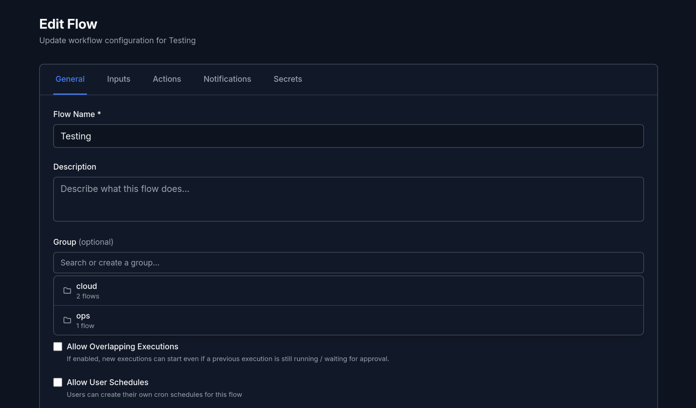
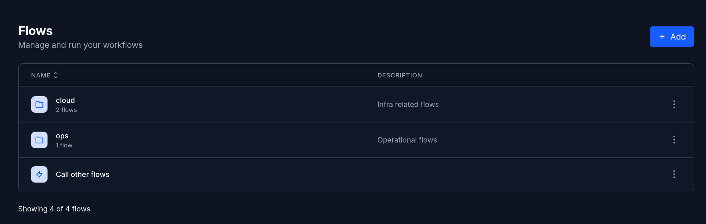
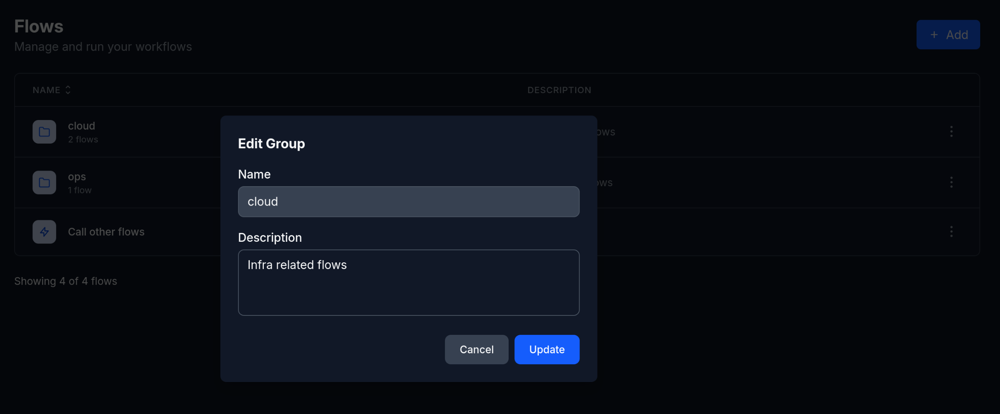
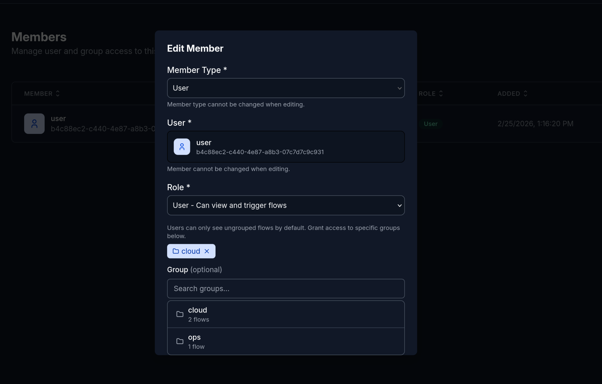

import { Aside } from "@astrojs/starlight/components";

Flow groups let you organize related flows under a shared prefix.

## Creating a Group

Set the `prefix` field in a flow's metadata to assign it to a group:

```yaml
metadata:
  id: create_instance
  name: Create Instance
  description: Provision a new cloud instance
  prefix: cloud
```

All flows with the same `prefix` value are grouped together. If the group doesn't exist yet, it's created automatically when the flow is imported.

You can also assign a group from the flow editor UI using the **Group** field:



To leave a flow ungrouped, set `prefix` to an empty string or omit it:

```yaml
metadata:
  id: hello_world
  name: Hello World
  prefix: ""
```

## Managing Groups

### Viewing Groups

Groups appear at the top of the flows list as folder icons, showing the number of flows in each group. Click a group to see its flows.



### Editing a Group

Click the **Edit** action on a group to update its description.



### Deleting a Group

Click the **Delete** action on a group. This permanently deletes the group **and all flows inside it**.

<Aside type="caution">
  Deleting a group deletes every flow in that group. This action cannot be
  undone.
</Aside>

## Access Control

Users with the **User** role can only see ungrouped flows by default. They do not have access to any flow groups until a namespace admin explicitly grants it.

### Granting Group Access

Namespace admins can grant group access to individual users:

1. Go to the **Members** section of your namespace
2. Click **Edit** on the member
3. Select a group from the dropdown
4. The user can now see and execute flows in that group



Multiple groups can be granted to the same user. To revoke access, click the remove button next to the group name.

<Aside>
  Group access control only applies to the **User** role. **Reviewer** and
  **Admin** roles have access to all groups automatically.
</Aside>

### Permissions

| Action        | User | Reviewer | Admin |
| ------------- | ---- | -------- | ----- |
| View groups   | ✗ \* | ✓        | ✓     |
| Edit groups   | ✗    | ✗        | ✓     |
| Delete groups | ✗    | ✗        | ✓     |

\* Users can only view groups they have been explicitly granted access to.

See [Access Control](/docs/general/access-control) for full details on roles and permissions.

## Next Steps

- Learn how to write [Flows](/docs/general/flows)
- Understand [Access Control](/docs/general/access-control)
