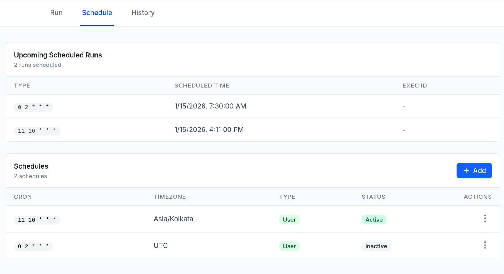
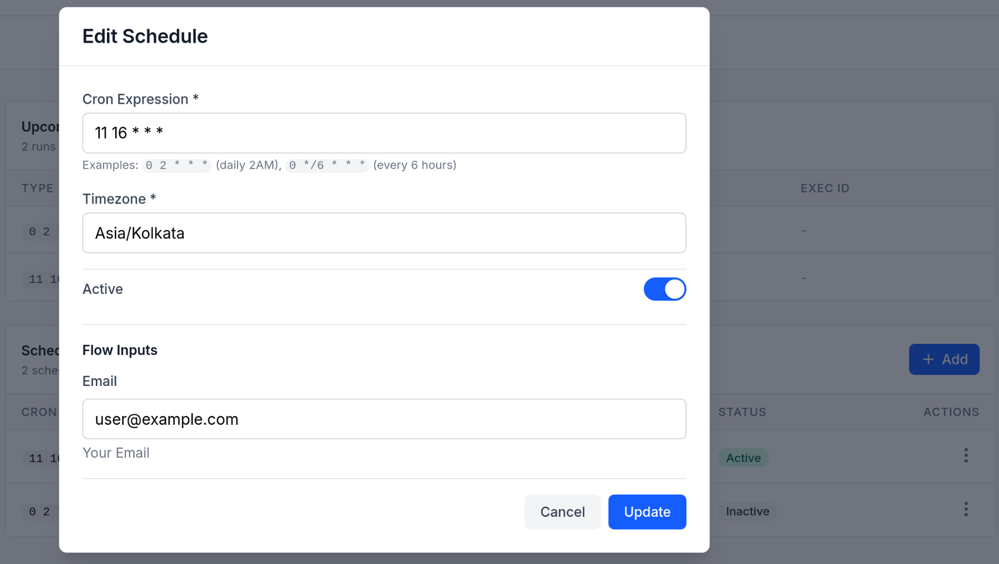
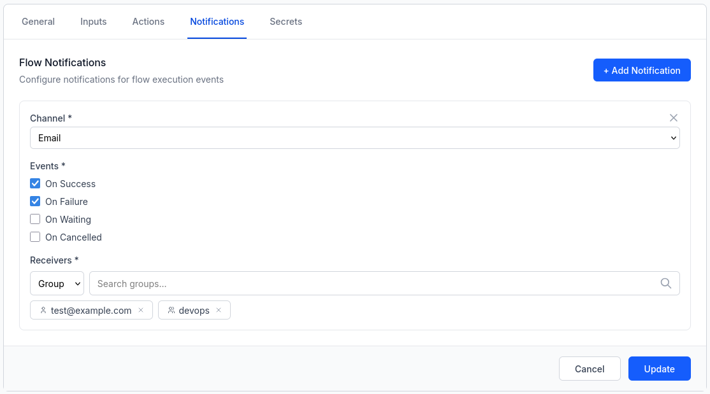

import { Tabs, TabItem } from "@astrojs/starlight/components";
import { Aside } from "@astrojs/starlight/components";

## What are Flows?

Flows are the core automation units in flowctl. A flow is a sequence of actions that execute in order, with support for inputs, variables, approvals. Flows are defined using YAML/[HUML](https://huml.io) files and can run locally or on remote nodes.

## Flow Structure

Every flow consists of five main sections:

1. **Metadata** - Flow identification and configuration
2. **Inputs** - Parameters that users provide when triggering the flow
3. **Actions** - The actual tasks to execute
4. **Schedules** - List of cron schedules
5. **Notifications** - Event-based notifications to users or groups

## Basic Flow Example

Here's a simple flow that greets a user:

```yaml
metadata:
  id: hello_world
  name: Hello World
  description: A simple greeting flow
  allow_overlap: true

inputs:
  - name: username
    type: string
    label: Username
    description: Your name
    required: true
    validation: len(username) > 0

actions:
  - id: greet
    name: Greet User
    executor: docker
    variables:
      - username: "{{ inputs.username }}"
    with:
      image: docker.io/alpine
      script: |
        echo "Hello, $username!"
        echo "message=Welcome!" >> $FC_OUTPUT
```

## Metadata

The metadata section defines the flow's identity and behavior:

```yaml
metadata:
  id: my_flow # Unique identifier (alphanumeric + underscore)
  name: My Flow # Human-readable name
  description: Flow description
  namespace: default # Namespace for organization
  allow_overlap: true # Allow executions to overlap
```

### Execution Overlap

If `allow_overlap` is set to true in a flow, executions for that flow can overlap. This is `false` by default which prevents executions from running if there is already an execution in running / pending state.

### Scheduling Flows

Flows can be scheduled using cron expressions.

```yaml
inputs:
  - name: environment
    type: string
    default: "production" # Required for scheduled flows

schedules:
  - cron: "0 2 * * *" # Run daily at 2 AM
    timezone: Asia/Kolkata
```

<Aside>
  Only flows where all inputs have default values can be scheduled. Flows with
  file inputs cannot be scheduled.
</Aside>

### User Schedules

You can also create your own schedules from the UI, separate from the ones defined in the flow YAML. These let you run the same flow on different schedules with different input values.

To enable this, add `user_schedulable: true` to your flow metadata:

```yaml
metadata:
  id: my_flow
  name: My Flow
  user_schedulable: true
```



Once enabled, go to a flow's **Schedule** tab and click **Add** to create a schedule.



<Aside>
  Like flow-defined schedules, user schedules require all inputs to have default
  values. File inputs aren't supported.
</Aside>

### Scheduling a Flow for Later

When triggering a flow manually you can defer execution by enabling the **Run Later** toggle. Choose a date, time, and timezone. The flow is queued and starts at the specified time.

The timezone selector defaults to your browser's local timezone. You can search for any IANA timezone (e.g. `America/New_York`, `Europe/Berlin`).

## Inputs

Inputs define parameters that users provide when triggering a flow. Flowctl supports multiple input types with validation.

### Input Types

<Tabs>
<TabItem label="String">

```yaml
inputs:
  - name: namespace
    type: string
    label: Namespace
    description: Target namespace
    required: true
    default: "default"
    validation: len(namespace) > 3
```

</TabItem>

<TabItem label="Number">

```yaml
inputs:
  - name: count
    type: number
    label: Retry Count
    description: Number of retries
    required: true
    validation: count > 0 && count < 10
```

</TabItem>

<TabItem label="Select">

```yaml
inputs:
  - name: environment
    type: select
    label: Environment
    description: Deployment environment
    options:
      - development
      - staging
      - production
    required: true
```

</TabItem>

<TabItem label="Checkbox">

```yaml
inputs:
  - name: enable_debug
    type: checkbox
    label: Enable Debug Mode
    description: Enable verbose logging
    default: false
```

</TabItem>

<TabItem label="Password">

```yaml
inputs:
  - name: api_token
    type: password
    label: API Token
    description: Authentication token
    required: true
```

</TabItem>

<TabItem label="File">

```yaml
inputs:
  - name: config_file
    type: file
    label: Configuration File
    description: Upload a configuration file
    required: true
    max_file_size: 10485760 # Optional: 10MB limit (default: 100MB)
```

</TabItem>
</Tabs>

### File Inputs

File inputs allow users to upload files when triggering a flow. The uploaded file is made available to actions via the artifacts system.

#### Using File Inputs in Actions

Reference file inputs using the standard `{{ inputs.file_name }}` syntax:

```yaml
inputs:
  - name: data_file
    type: file
    label: Data File
    required: true

actions:
  - id: process_file
    name: Process Uploaded File
    executor: docker
    variables:
      - file_path: "{{ inputs.data_file }}"
    with:
      image: docker.io/alpine
      script: |
        echo "Processing: $file_path"
        cat "$file_path"

        # Files are also available in the uploads directory
        ls -la $FC_ARTIFACTS/uploads/
```

#### File Input Limitations

- **No default values**: File inputs cannot have default values
- **Not schedulable**: Flows with file inputs cannot be scheduled (files must be provided at execution time)
- **Size limits**: Default maximum file size is 100MB, configurable per-input via `max_file_size` (in bytes) or globally in server config

#### Remote Execution

When running on remote nodes, uploaded files are automatically transferred to the remote node before execution. The file path in your variable will point to the correct location on the remote system.

### Input Validation

Use the `validation` field with expressions to validate input values:

```yaml
inputs:
  - name: port
    type: number
    validation: port >= 1024 && port <= 65535

  - name: username
    type: string
    validation: len(username) >= 3 && len(username) <= 20
```

Validations are [expr](https://expr-lang.org/) statements that should evaluate to either `true` or `false`.

## Actions

Actions are the executable steps in a flow. Each action runs sequentially unless it fails.


### Action Structure

```yaml
actions:
  - id: action_id # Unique action identifier
    name: Action Name # Display name
    executor: docker # Executor type: docker or script
    on: # Optional: remote nodes to run on
      - NodeName1
      - NodeName2
    variables: # Variables available to the script
      - var_name: "{{ expression }}"
    with: # Executor-specific configuration
      image: alpine
      script: |
        echo "Script here"
    approval: false # Require manual approval
```

### Executors

Flowctl supports two executor types:

#### Docker Executor

Runs scripts in Docker containers:

```yaml
- id: build
  name: Build Application
  executor: docker
  variables:
    - environment: "{{ inputs.env }}"
  with:
    image: docker.io/node:18
    script: |
      npm install
      npm run build
      echo "BUILD_ID=$(date +%s)" >> $FC_OUTPUT
```

#### Script Executor

Executes scripts directly on the target system (local or remote):

```yaml
- id: deploy
  name: Deploy to Server
  executor: script
  on:
    - ProductionServer
  variables:
    - app_name: "{{ inputs.app_name }}"
  with:
    script: |
      cd /opt/$app_name
      git pull
      systemctl restart $app_name
```

### Variables

Variables are defined per-action and can reference inputs, secrets, or previous action outputs:

```yaml
variables:
  # From inputs
  - username: "{{ inputs.username }}"

  # From secrets
  - api_key: "{{ secrets.API_KEY }}"

  # From previous action outputs
  - build_id: "{{ outputs.BUILD_ID }}"

  # Using expressions
  - uppercase_name: "{{ upper(inputs.name) }}"
  - sum: "{{ inputs.num1 + inputs.num2 }}"
  - is_prod: "{{ inputs.env == 'production' }}"
```

<Aside type="tip">
  You can use [expr](https://expr-lang.org/) expressions to define variables.
</Aside>

### Flow Secrets

Flow secrets allow you to securely store sensitive information like API tokens, passwords, and credentials that your flow needs to access. Secrets are encrypted at rest and never displayed after creation.

#### Managing Secrets

Secrets are managed per-flow through the flowctl UI:

1. Navigate to your flow's configuration
2. Go to the "Secrets" tab
3. Add, edit, or delete secrets as needed

Secrets can be only added after the flow is created.


Each secret has:

- **Key**: The name used to reference the secret (e.g., `API_TOKEN`, `DB_PASSWORD`)
- **Value**: The sensitive data (encrypted and never displayed after creation)
- **Description**: Optional note about what the secret is for

<Aside type="caution">
  Secret values cannot be viewed after creation. When editing a secret, you must
  provide a new value.
</Aside>

#### Using Secrets in Flows

Access secrets in your flow using the `secrets` context within variables:

```yaml
actions:
  - id: deploy
    name: Deploy Application
    executor: docker
    variables:
      - PGPASSWORD: "{{ secrets.DB_PASSWORD }}"
    with:
      image: alpine
      script: |
        # Secrets are available as environment variables
        echo "Connecting to database..."
        psql -U postgres -c "SELECT 1"
```

### Approvals

Require manual approval before an action executes:

```yaml
- id: deploy_production
  name: Deploy to Production
  executor: docker
  approval: true # Flow pauses here for approval
  with:
    image: alpine
    script: |
      echo "Deploying to production..."
```

When a flow reaches an approval action, it pauses and waits for a user to approve or reject it through the UI.
Only users with **Admin** or **Reviewer** role can approve requests.

### Artifacts

Preserve files generated during action execution:

```yaml
- id: generate_report
  name: Generate Report
  executor: docker
  with:
    image: alpine
    script: |
      mkdir /reports
      echo "Report content" > $FC_ARTIFACTS/report.txt
```

<Aside type="note">
  Only top level files in the `$FC_ARTIFACTS` directory will be transferred
  between jobs. Any directories added here will be ignored. Files produced on
  the local node (default, when no nodes are selected), will be available under
  the `local` directory under `$FC_ARTIFACTS`
</Aside>
Any files copied to the `$FC_ARTIFACTS` directory will be available as artifacts
in subsequent actions under the same directory.

Artifacts from remote nodes are automatically transferred and made available to subsequent actions at `$FC_ARTIFACTS/<NodeName>/path/to/artifact`. If the execution was local, the `<NodeName>` is `local`.

**Example: Using artifacts across nodes**

```yaml
actions:
  - id: create_on_remote
    name: Create File on Remote
    executor: docker
    on:
      - RemoteNode
    with:
      image: alpine
      script: |
        echo "Hello from remote" > $FC_ARTIFACTS/message.txt

  - id: use_on_local
    name: Use File Locally
    executor: docker
    with:
      image: alpine
      script: |
        # Access artifact from RemoteNode
        cat $FC_ARTIFACTS/RemoteNode/message.txt
```

### Remote Execution

Execute actions on remote nodes using the `on` field:

```yaml
- id: remote_task
  name: Run on Remote Server
  executor: script
  on:
    - WebServer1
    - WebServer2
  with:
    script: |
      hostname
      uptime
```

The action runs on all specified nodes in parallel.

Actions can write output variables using the `$FC_OUTPUT` file:

```yaml
script: |
  echo "KEY=value" >> $FC_OUTPUT
  echo "RESULT=success" >> $FC_OUTPUT
```

Access these in outputs or subsequent actions:

```yaml
variables:
  - key_value: "{{ outputs.KEY }}"
```

If the output is from a remote node, access it as:

```yaml
variables:
  - key_value: "{{ outputs.RemoteNodeName.KEY }}"
```

## Notifications

Configure notifications to alert users or groups when specific flow events occur.

### Notification Configuration

```yaml
metadata:
  id: deployment_flow
  name: Production Deployment
  description: Deploy application to production

notify:
  - channel: email
    config:
      receivers:
        - admin@example.com
        - group:devops-team
    events:
      - on_failure
      - on_waiting

  - channel: webhook
    config:
      url: "https://example.com/webhooks/flowctl"
    events:
      - on_success
      - on_failure
```



### Notification Channels

Flowctl supports the following notification channels:

- **email** - Send notifications via email to individual users or groups
- **webhook** - Send notifications via HTTP POST requests using the [Standard Webhooks](https://www.standardwebhooks.com/) format

### Notification Events

You can configure notifications for the following events:

| Event          | Description                                     |
| -------------- | ----------------------------------------------- |
| `on_success`   | Triggered when the flow completes successfully  |
| `on_failure`   | Triggered when the flow encounters an error     |
| `on_waiting`   | Triggered when the flow is waiting for approval |
| `on_cancelled` | Triggered when the flow execution is cancelled  |

### Receivers

Email notifications use `config.receivers` to specify who should be notified. Receivers can be:

1. **Individual Users** - Specify user email addresses directly. Users active in flowctl and external users are supported.

   ```yaml
   config:
     receivers:
       - user1@example.com
       - user2@example.com
   ```

2. **Groups** - Reference groups using the `group:` prefix:
   ```yaml
   config:
     receivers:
       - group:devops
       - group:tech
   ```

### Webhook Notifications

Webhook notifications send an HTTP POST request to a configured URL using the [Standard Webhooks](https://www.standardwebhooks.com/) format. Each request includes the following headers for verification:

- `webhook-id` - Unique message identifier
- `webhook-timestamp` - Unix timestamp of the request
- `webhook-signature` - Ed25519 signature (`v1a,<base64-encoded-signature>`)

The signature is computed over the string `{webhook-id}.{webhook-timestamp}.{body}` using the Ed25519 private key configured in `config.toml`. The payload is a JSON object containing the event type and notification data.

```json
{
  "type": "flow.execution",
  "timestamp": "2026-02-19T06:51:14.812322765Z",
  "data": {
    "flow_id": "example_flow",
    "flow_name": "Example Flow",
    "exec_id": "c1203042-f9e5-4f07-b8be-84e2e0a6a28f",
    "status": "completed",
    "error": "",
    "namespace": "default"
  }
}
```

For webhook notifications, provide the target URL in the `config` field:

```yaml
notify:
  - channel: webhook
    config:
      url: "https://example.com/webhooks/flowctl"
    events:
      - on_success
      - on_failure
```

<Aside type="note">
  Webhook notifications require the webhook messenger to be enabled and an
  Ed25519 signing key to be configured in the server's `config.toml`. See the
  [webhook configuration](/docs/#webhook-notifications) for setup details.
</Aside>

### Multiple Notification Configurations

You can configure multiple notification rules for different events and channels:

```yaml
notify:
  # Alert tech team for failures
  - channel: email
    config:
      receivers:
        - group:tech
    events:
      - on_failure

  # Alert reviewers when approval is needed
  - channel: email
    config:
      receivers:
        - group:reviewers
    events:
      - on_waiting

  # Send to an external service
  - channel: webhook
    config:
      url: "https://example.com/webhooks/flowctl"
    events:
      - on_success
      - on_failure
```

## Duplicating a Flow

To create a copy of an existing flow, open the flow list, click the **...** menu on any flow, and select **Duplicate**. The create form opens pre-filled with the original flow's metadata, inputs, actions, and notifications.

<Aside type="caution">
  Secrets are not copied. Re-add any secrets under the **Secrets** tab after the
  duplicated flow is created.
</Aside>

## Next Steps

- Configure [Remote Nodes](/docs/general/nodes-and-executors#remote-nodes)
- Learn about [Executors](/docs/general/nodes-and-executors)
- Explore [Access Control](/docs/general/access-control)
